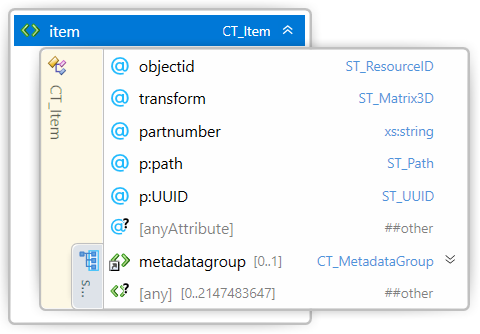
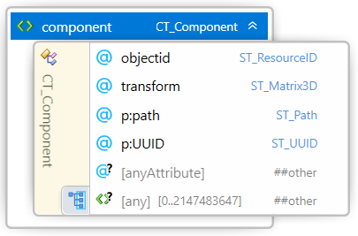
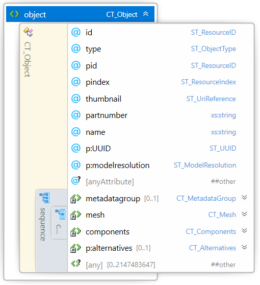
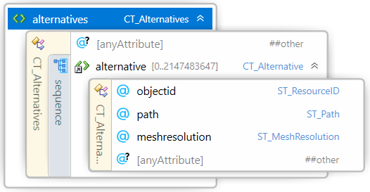
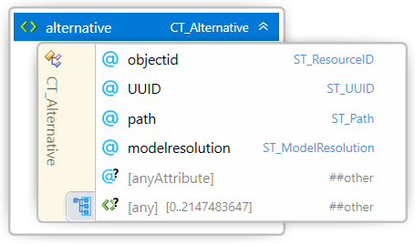

#  3MF Production Extension

## Specification & Reference Guide


| **Version** | 1.2 |
| --- | --- |
| **Status** | Draft |

## Disclaimer

THESE MATERIALS ARE PROVIDED "AS IS." The contributors expressly disclaim any warranties (express, implied, or otherwise), including implied warranties of merchantability, non-infringement, fitness for a particular purpose, or title, related to the materials. The entire risk as to implementing or otherwise using the materials is assumed by the implementer and user. IN NO EVENT WILL ANY MEMBER BE LIABLE TO ANY OTHER PARTY FOR LOST PROFITS OR ANY FORM OF INDIRECT, SPECIAL, INCIDENTAL, OR CONSEQUENTIAL DAMAGES OF ANY CHARACTER FROM ANY CAUSES OF ACTION OF ANY KIND WITH RESPECT TO THIS DELIVERABLE OR ITS GOVERNING AGREEMENT, WHETHER BASED ON BREACH OF CONTRACT, TORT (INCLUDING NEGLIGENCE), OR OTHERWISE, AND WHETHER OR NOT THE OTHER MEMBER HAS BEEN ADVISED OF THE POSSIBILITY OF SUCH DAMAGE.

## Table of Contents

- [Preface](#preface)
  * [About this Specification](#about-this-specification)
  * [Document Conventions](#document-conventions)
  * [Language Notes](#language-notes)
  * [Software Conformance](#software-conformance)
- [Part I: 3MF Production Extension](#part-i-3mf-production-extension)
  * [Chapter 1. Overview of Additions](#chapter-1-overview-of-additions)
  * [Chapter 2. Model Relationships](#chapter-2-model-relationships)
  * [Chapter 3. Production Extension Data Details](#chapter-3-production-extension-data-details)
    + [3.1 The Path Attribute](#31-the-path-attribute)
    + [3.2 Path Usage](#32-path-usage)
    + [3.3 OPC Relation Files](#33-opc-relation-files)
  * [Chapter 4. Identifying Build Components](#chapter-4-identifying-build-components)
    + [4.1 Build](#41-build)
    + [4.2 Object](#42-object)
- [Part II. Appendices](#part-ii-appendices)
  * [Appendix A. Glossary](#appendix-a-glossary)
  * [Appendix B. 3MF Production Extension Schema](#appendix-b-3mf-production-extension-schema)
  * [Appendix C. Standard Namespaces and Content Types](#appendix-c-standard-namespaces-and-content-types)
- [References](#references)

# Preface

## About this Specification

This 3MF Production Extension specification is an extension to the core 3MF specification. This document cannot stand alone and only applies as an addendum to the core 3MF specification. Usage of this and any other 3MF extensions follow an a la carte model, defined in the core 3MF specification.

Part I, "3MF Documents," presents the details of the primarily XML-based 3MF Document format. This section describes the XML markup that defines the composition of 3D documents and the appearance of each model within the document.

Part II, "Appendices," contains additional technical details and schemas too extensive to include in the main body of the text as well as convenient reference information.

The information contained in this specification is subject to change. Every effort has been made to ensure its accuracy at the time of publication.

This extension MUST be used only with Core specification 1.x.

## Document Conventions

See [the 3MF Core Specification conventions](https://github.com/3MFConsortium/spec_core/blob/master/3MF%20Core%20Specification.md#document-conventions).

In this extension specification, as an example, the prefix "p" maps to the xml-namespace "http://schemas.microsoft.com/3dmanufacturing/production/2015/06", as defined in 1.x, and the prefix "pa" maps to the xml namespace "http://schemas.microsoft.com/3dmanufacturing/production/alternatives/2021/04". See Appendix [D.1 Namespaces](#d1-namespaces).

## Language Notes

See [the 3MF Core Specification language notes](https://github.com/3MFConsortium/spec_core/blob/master/3MF%20Core%20Specification.md#language-notes).

## Software Conformance

See [the 3MF Core Specification software conformance](https://github.com/3MFConsortium/spec_core/blob/master/3MF%20Core%20Specification.md#software-conformance).

# Part I: 3MF Production Extension

# Chapter 1. Overview of Additions

This document describes new non-object resources, as well as attributes to the build section for uniquely identifying parts within a particular 3MF package. If not explicitly stated otherwise, each of these resources is OPTIONAL for producers, but MUST be supported by consumers that specify support for the Production Extension of 3MF.

In order to allow for the use of 3MF in high production printing environments, several additions are needed to efficiently support packed build platforms and ensure integrity of the payload:

- Enable the 3MF \<build> elements to address objects in separate files within the 3MF package
- Identify each build, each object and each copy of a part with unique identifiers
- Define alternative model representations targeted to different applications, where some of those models might be protected.

>**Note:** "Unique identifier" MUST be any of the four UUID variants described in IETF RFC 4122, which includes Microsoft GUIDs as well as time-based UUIDs.

A consumer supporting the production extension MUST be able to consume non-extended core 3MFs, even if this is not as efficient. As the production extension is just a reorganization of data, a consumer MAY convert a generic core 3MF into a "production extended 3MF" before internally processing the data.

In order to avoid data loss while parsing, a 3MF package which uses referenced objects MUST enlist the production extension(s) as "required extension", as defined in the core specification.

# Chapter 2. Model Relationships

The primary emphasis of this extension is the possibility to store model data in files separate from the root model file and to allow the root model file's build element to reference those resources. This structural approach enables three primary advantages for producers and consumers of 3MF packages with large numbers of individual models:

- The build directive in the root model file can be parsed by consumers without having to parse any actual model data.
- Moving from a single-part 3MF (e.g. from a design application) into a high-part-density 3MF build can be largely a pass-through from the original 3MF to the "production" 3MF.
- Parsing the model objects from individual XML files will often require fewer resources than parsing a monolithic model file that could be more that 500MB in size.

The root model part MAY have relationships to other model parts, whose object resources can be referenced by the parent model stream using the "path" attribute on a build item element or within a component.

As defined in the core 3MF spec, only the build section of the root model file contains valid build information. Other model streams SHOULD contain empty build sections. Every consumer MUST ignore the build section entries of all referenced child model files.

Further, only a component element in the root model file MAY contain a path attribute. Non-root model file components MUST only reference objects in the same model file.

These two limitations ensure there is only a single level of "depth" to multi-file model relationships within a package and explicitly prevents complex or circular object references.

# Chapter 3. Production Extension Data Details


_Figure 3–1. A typical production 3MF Document with multiple model streams_

## 3.1 The Path Attribute

### 3.1.1 Item

Within the \<item> element of the build section in the root model, there is a new, optional attribute called "path". Path is an absolute path to the target model file inside the 3MF container that contains the target object. When the path attribute is used, objectid becomes a reference to the object within the referenced model.



##### Attributes

| Name | Type | Use | Default | Annotation |
| --- | --- | --- | --- | --- |
| path | **ST\_Path** | optional | | A file path to the model file being referenced. The path is an absolute path from the root of the 3MF container. |
| objectid | **ST\_ResourceID** | required | | Objectid is part of the core 3MF specification, and its use in the production extension the same: objectid indexes into the model file to the object with the corresponding id. The only difference is that the path attribute identifies the target file from which to load the specified object. |
| @anyAttribute | | | | |

### 3.1.2 Component

Within the \<component> elements of component-based objects, the "path" attribute references objects in non-root model files. Path is an absolute path to the target model file inside the 3MF container that contains the target object. The use of the path attribute in a component element is ONLY valid in the root model file.



##### Attributes

| Name | Type | Use | Default | Annotation |
| --- | --- | --- | --- | --- |
| path | **ST\_Path** | optional | | A file path to the model file being referenced. The path is an absolute path from the root of the 3MF container. |
| objectid | **ST\_ResourceID** | required | | Objectid is part of the core 3MF specification, and its use in the production extension the same: objectid indexes into the model file to the object with the corresponding id. The only difference is that the path attribute identifies the target file from which to load the specified object. |
| @anyAttribute | | | | |

## 3.2 Path Usage

The path attribute is optional, even for 3MF containers that claim support for the production extension. It is possible to construct a 3MF package with objects both in the root model file and in other model files in the container.

Some considerations for using multiple file 3MF constructions with the path attribute:

Objects referenced by the path and objectid attribute of the build item inherit all of their properties from their own object definition and resources. All of the resources associated with the referenced object (textures, materials, thumbnails, name, part number, etc.) MUST come from the referenced object file.

The model level Metadata element is only valid in the root model file of a 3MF package. All Metadata elements in other model files in a 3MF package will be ignored.

A path attribute can reference an object in a target file that is made up of components. In this case, the same processing rules apply as with a local component object: the object transforms are relative to the item transform and consumers MUST not alter the relative transformations within the component objects.

A root model based component can be partially, or fully, composed of objects from different model files. This allows a single component reference to place objects from multiple files (including the root model file) into a virtual assembly that is bound to the origin of the build item transformation. Any consumer of a 3MF package that contains path attributes in components in a non-root model file MUST generate an error for that package.

Because there can be only a single build section (in the root model), there is at most a single level of referenced objects in any 3MF container. This eliminates the possibility for complex or circular object references between model files in 3MF containers.

## 3.3 OPC Relation Files

All model files in the 3MF package MUST be referenced in .rels files in order to conform with OPC standards. The root model file MUST always be referenced in the root .rels file. Example root .rels file:
```xml
<?xml version="1.0" encoding="utf-8"?>
    <Relationships xmlns="http://schemas.openxmlformats.org/package/2006/relationships">
    <Relationship Type="http://schemas.microsoft.com/3dmanufacturing/2013/01/3dmodel" Target="/3D/build.model" Id="rel0" />
    <Relationship Type="http://schemas.openxmlformats.org/package/2006/relationships/metadata/thumbnail" Target="/Metadata/thumbnail.png" Id="rel4" />
</Relationships>
```

Non-root model files MUST not be referenced from the root .rels file. Referenced model files MUST be included in the .rels file from the referencing model file according to the part relationship defined in OPC. For example, assuming that the root model file in the /3D folder is named model.model, the non-root model file references MUST be in the /3D/\_rels/model.model.rels file:

```xml
<?xml version="1.0" encoding="utf-8"?>
    <Relationships xmlns="http://schemas.openxmlformats.org/package/2006/relationships">
    <Relationship Type="http://schemas.microsoft.com/3dmanufacturing/2013/01/3dmodel" Target="/3D/object1.model" Id="rel1" />
    <Relationship Type="http://schemas.microsoft.com/3dmanufacturing/2013/01/3dmodel" Target="/3D/object2.model" Id="rel2" />
    <Relationship Type="http://schemas.microsoft.com/3dmanufacturing/2013/01/3dmodel" Target="/3D/object3.model" Id="rel3" />
</Relationships>

```

# Chapter 4. Identifying Build Components

Components of 3MF containers need to be uniquely identifiable in order to ensure tracking of builds and parts through build processes. Within a given 3MF container, build items can be uniquely identified by providing a UUID for each \<item>. Individual objects (models) in a build can be uniquely identified with a UUID on each \<object> element. Individual component-based parts can be identified using a UUID attribute on \<component> elements.

The Production Extension REQUIRES that both \<item> and \<component> elements include the UUID attribute as a mechanism to identify model instances being used in the 3MF package.

In some environments, it is crucial that the builds themselves can be uniquely identified within, and even across, different physical devices. In order to support cross-printer and cross-print-job build identification, \<build> elements in the root model part REQUIRE a UUID attribute.

## 4.1 Build

Element **\<build>**


| Name | Type | Use | Default | Annotation |
| --- | --- | --- | --- | --- |
| uuid | **ST\_UUID** | required | | A universally unique ID that allows the build to be identified over time and across physical clients and printers. |
| @anyAttribute | | | | |


Producers MUST provide a UUID in the root model file build element to ensure that a 3MF package can be tracked across uses by various consumers.

### 4.1.1 Item

Element **\<item>**


| Name | Type | Use | Default | Annotation |
| --- | --- | --- | --- | --- |
| UUID | **ST\_UUID** | required | | A globally unique identifier for each item in the 3MF package which allows producers and consumers to track part instances across 3MF packages. |
| @anyAttribute | | | | |

Producers MUST include UUID's for all build items for traceability across 3MF packages.

## 4.2 Object

Element **\<object>**



| Name | Type | Use | Default | Annotation |
| --- | --- | --- | --- | --- |
| UUID | **ST\_UUID** | required | | A globally unique identifier for each \<object> in the 3MF package which allows producers and consumers to track object instances across 3MF packages. In the case that an \<object> is made up of \<components>, the UUID represents a unique ID for that collection of object references. |
| modelresolution | **ST\_ModelResolution** |  | fullres  | Indicates the intended use of the object model when there are alternative representiations. |
| @anyAttribute | | | | |

Producers MUST include UUID's in all \<object> references to ensure that each object can be reliably tracked.

The *modelresolution*, defined in the alternative's namespace, indicates the intended use the alternative object model. Valid options are: fullres, lowres, obfuscated.

### 4.2.1 Component

Element **\<component>**


| Name | Type | Use | Default | Annotation |
| --- | --- | --- | --- | --- |
| UUID | **ST\_UUID** | required | | A globally unique identifier for each object component in the 3MF package which allows producers and consumers to track part instances across 3MF packages. | @anyAttribute | | | | |

Producers MUST include UUID's in all component-based object references to ensure that each instance of an object can be reliably tracked.

### 4.2.2 Alternatives

Element **\<alternative>**



The \<alternatives> element group provides a way to specify alternative representations of a given model. For example, a 3MF with a low resolution object MAY be accepted by an application for previewing purposes but it MAY be rejected by a printer.

When this is used in conjunction with [the 3MF Secure Content Extension](https://github.com/3MFConsortium/spec_securecontent/blob/master/3MF%20Secure%20Content.md), some of those models might be protected with encryption and consumers might use an alterative representation were they have access.

When several alternative representations are available, including the one in the root model, the consumer MAY decide which representation to choose from the ones that has rights. A consumer MAY select a fullres resolution over a lowres or obfuscated. And a printer might reject to print a lowres model.

The producer MUST generate a 3MF file with no ambiguity for the consumer. When there is ambiguity, for example two fullres models available for a consumer, the consumer MAY decide which one to select, and the producer MAY not infer which one.

### 4.2.2.1 Alternative

Element **\<alternative>**



| Name | Type | Use | Default | Annotation |
| --- | --- | --- | --- | --- |
| objectid | **ST\_ResourceID** | required | | objectid indexes into the model file to the object with the corresponding id. |
| UUID | **ST\_UUID** | required | | A globally unique identifier to allow to identify the alternative model. |
| path | **ST\_Path** | | | An optional file path to the alternative model file being referenced. The path is an absolute path from the root of the 3MF container. |
| modelresolution | **ST\_ModelResolution** |  | fullres  | Indicates the intended use the alternative object model. Valid options are: fullres, lowres, obfuscated. |
| @anyAttribute | | | | |

The \<alternative> element specifies an alternative representations of a given model. The alternative MAY replace the object content representation, either the content under mesh or components.

Only an object in the root model file MAY contain alternative representations in a different model file. A non-root model file object MUST only reference objects in the same model file.

These two limitations ensure there is only a single level of "depth" to multi-file model relationships within a package and explicitly prevents complex or circular object references.

The *modelresolution* attribute specifies the intent of the model:

* *fullres*: the model is a high resolution and it is intended for printing.
* *obfuscated*: the intent of the obfuscated model is to provide a modified version of the fullres model by hiding some condidentially sensitive zones. An "obfuscated" model MUST fully enclose the shape of the "fullres" version, for example, for packing purposes.
* *lowres*: the model is low resolution, for example for visualization purposes.

It defines as well the priority order to select the alternative representation: 1. *fullres* -> 2. *obfuscated* -> 3. *lowres*. When two or more alternative representation of the same *modelresolution* are available and the consumer has "access rights" to that object, the priority order is defined by the direct order in the \<alternative> element sequence, and being the representation in the referencing object the one with last priority.

A production printer MUST reject models with only a "lowres" representation available for printing. For example, if the "fullres" model file is encrypted the production printer MUST be able to decrypt it. Printing an "obfuscated" MIGHT or MIGHT NOT be accepted, depending on the printing intent. For example it MIGHT be accepted for viewing purposes or prototyping, but it MUST be rejected for final production.

The *modelresolution* specified in the \<alternative> element overrides the optionally specified in the referenced model by the path.

# Part II. Appendices

## Appendix A. Glossary

See [the 3MF Core Specification glossary](https://github.com/3MFConsortium/spec_core/blob/master/3MF%20Core%20Specification.md#appendix-a-glossary).

## Appendix B. 3MF XSD Schema

### B.1. Production Schema

```xml
<?xml version="1.0" encoding="UTF-8"?>
<xs:schema xmlns="http://schemas.microsoft.com/3dmanufacturing/production/2015/06"
	xmlns:xs="http://www.w3.org/2001/XMLSchema" xmlns:xml="http://www.w3.org/XML/1998/namespace"
	targetNamespace="http://schemas.microsoft.com/3dmanufacturing/production/2015/06"
	elementFormDefault="unqualified" attributeFormDefault="unqualified" blockDefault="#all">
	<xs:import namespace="http://www.w3.org/XML/1998/namespace"
		schemaLocation="http://www.w3.org/2001/xml.xsd"/>

	<!-- Complex Types -->

	<xs:complexType name="CT_Item">
		<xs:attribute name="path" type="ST_Path"/>
		<xs:attribute name="UUID" type="ST_UUID" use="required"/>
		<xs:anyAttribute namespace="##other" processContents="lax"/>
	</xs:complexType>

	<xs:complexType name="CT_Component">
		<xs:attribute name="path" type="ST_Path"/>
		<xs:attribute name="UUID" type="ST_UUID" use="required"/>
		<xs:anyAttribute namespace="##other" processContents="lax"/>
	</xs:complexType>

    <xs:complexType name="CT_Object">
        <xs:attribute name="id" type="ST_ResourceID" use="required"/>
        <xs:attribute name="UUID" type="ST_UUID" use="required"/>
        <xs:anyAttribute namespace="##other" processContents="lax"/>
    </xs:complexType>
	
	<xs:complexType name="CT_Build">
		<xs:attribute name="UUID" type="ST_UUID" use="required"/>
		<xs:anyAttribute namespace="##other" processContents="lax"/>
	</xs:complexType>

	<!-- Simple Types -->

	<xs:simpleType name="ST_ResourceID">
		<xs:restriction base="xs:positiveInteger">
			<xs:maxExclusive value="2147483648"/>
		</xs:restriction>
	</xs:simpleType>
	
	<xs:simpleType name="ST_Path">
		<xs:restriction base="xs:string"> </xs:restriction>
	</xs:simpleType>
	
	<xs:simpleType name="ST_UUID">
		<xs:restriction base="xs:string">
			<xs:pattern value="[a-f0-9]{8}-[a-f0-9]{4}-[a-f0-9]{4}-[a-f0-9]{4}-[a-f0-9]{12}"/>
		</xs:restriction>
	</xs:simpleType>
	
	<!-- Elements -->
	<xs:element name="item" type="CT_Item"/>
	<xs:element name="component" type="CT_Component"/>
	<xs:element name="object" type="CT_Object"/>
	<xs:element name="build" type="CT_Build"/>
	
</xs:schema>
```

### B.2. Production Alternatives Schema

```xml
<?xml version="1.0" encoding="UTF-8"?>
<xs:schema xmlns="http://schemas.microsoft.com/3dmanufacturing/production/alternatives/2021/04"
	xmlns:xs="http://www.w3.org/2001/XMLSchema" xmlns:xml="http://www.w3.org/XML/1998/namespace"
	targetNamespace="http://schemas.microsoft.com/3dmanufacturing/production/alternatives/2021/04"
	elementFormDefault="unqualified" attributeFormDefault="unqualified" blockDefault="#all">
	<xs:import namespace="http://www.w3.org/XML/1998/namespace"
		schemaLocation="http://www.w3.org/2001/xml.xsd"/>

	<!-- Complex Types -->

	<xs:complexType name="CT_Object">
		<xs:sequence>
			<xs:element ref="alternatives" minOccurs="0" maxOccurs="1"/>
			<xs:any namespace="##other" processContents="lax" minOccurs="0" maxOccurs="2147483647"/>
		</xs:sequence>
		<xs:attribute name="modelresolution" type="ST_ModelResolution" default="fullres"/>
		<xs:anyAttribute namespace="##other" processContents="lax"/>
	</xs:complexType>

	<xs:complexType name="CT_Alternatives">
		<xs:sequence>
			<xs:element ref="alternative" minOccurs="0" maxOccurs="2147483647"/>
		</xs:sequence>
		<xs:anyAttribute namespace="##other" processContents="lax"/>
	</xs:complexType>
	
	<xs:complexType name="CT_Alternative">
		<xs:sequence>
			<xs:any namespace="##other" processContents="lax" minOccurs="0" maxOccurs="2147483647"/>
		</xs:sequence>
		<xs:attribute name="objectid" type="ST_ResourceID" use="required"/>
		<xs:attribute name="UUID" type="ST_UUID" use="required"/>
		<xs:attribute name="path" type="ST_Path"/>
		<xs:attribute name="modelresolution" type="ST_ModelResolution" default="fullres"/>
		<xs:anyAttribute namespace="##other" processContents="lax"/>
	</xs:complexType>
	
	<!-- Simple Types -->

	<xs:simpleType name="ST_ResourceID">
		<xs:restriction base="xs:positiveInteger">
			<xs:maxExclusive value="2147483648"/>
		</xs:restriction>
	</xs:simpleType>
	
	<xs:simpleType name="ST_Path">
		<xs:restriction base="xs:string"> </xs:restriction>
	</xs:simpleType>
	
	<xs:simpleType name="ST_UUID">
		<xs:restriction base="xs:string">
			<xs:pattern value="[a-f0-9]{8}-[a-f0-9]{4}-[a-f0-9]{4}-[a-f0-9]{4}-[a-f0-9]{12}"/>
		</xs:restriction>
	</xs:simpleType>

	<xs:simpleType name="ST_ModelResolution">
		<xs:restriction base="xs:string">
			<xs:enumeration value="fullres"/>
			<xs:enumeration value="lowres"/>
			<xs:enumeration value="obfuscated"/>
		</xs:restriction>
	</xs:simpleType>
	
	<!-- Elements -->
	<xs:element name="object" type="CT_Object"/>
	<xs:element name="alternatives" type="CT_Alternatives"/>
	<xs:element name="alternative" type="CT_Alternative"/>
	
</xs:schema>
```

## Appendix C. 3MF Samples

### C.1. Simple Production Sample
```xml
<?xml version="1.0" encoding="utf-8"?>
<model xmlns="http://schemas.microsoft.com/3dmanufacturing/core/2015/02" unit="millimeter" xml:lang="en-US" xmlns:p="http://schemas.microsoft.com/3dmanufacturing/production/2015/06">
   	<metadata name="Copyright">Copyright (c) 2018 3MF Consortium. All rights reserved.</metadata>
	<resources>
		<object id="1" name="box" type="model" thumbnail="/Thumbnails/box.png" p:UUID="01cbb956-1d24-062d-fbe6-7362e5727594">
			<mesh>
				<vertices>
					<vertex x="35.00000" y="33.00000" z="16.92000" />
					<vertex x="45.00000" y="33.00000" z="16.92000" />
					<vertex x="45.00000" y="53.00000" z="16.92000" />
					<vertex x="35.00000" y="53.00000" z="16.92000" />
					<vertex x="35.00000" y="33.00000" z="46.92000" />
					<vertex x="45.00000" y="33.00000" z="46.92000" />
					<vertex x="45.00000" y="53.00000" z="46.92000" />
					<vertex x="35.00000" y="53.00000" z="46.92000" />
				</vertices>
				<triangles>
					<triangle v1="3" v2="2" v3="1" />
					<triangle v1="1" v2="0" v3="3" />
					<triangle v1="4" v2="5" v3="6" />
					<triangle v1="6" v2="7" v3="4" />
					<triangle v1="0" v2="1" v3="5" />
					<triangle v1="5" v2="4" v3="0" />
					<triangle v1="1" v2="2" v3="6" />
					<triangle v1="6" v2="5" v3="1" />
					<triangle v1="2" v2="3" v3="7" />
					<triangle v1="7" v2="6" v3="2" />
					<triangle v1="3" v2="0" v3="4" />
					<triangle v1="4" v2="7" v3="3" />
				</triangles>
			</mesh>
		</object>
	</resources>
	<build p:UUID="96681a5d-5b0f-e592-8c51-da7ed587cb5f">
		<item objectid="1" p:UUID="b3de5826-ccb6-3dbc-d6c4-29a2d730766c" />
	</build>
</model>
```


### C.2. Alternatives Production Sample

Same example as in C2 but with a low resolution default model an alternative representation at full resolution.

```xml
<?xml version="1.0" encoding="utf-8"?>
<model xmlns="http://schemas.microsoft.com/3dmanufacturing/core/2015/02" unit="millimeter" xml:lang="en-US" xmlns:p="http://schemas.microsoft.com/3dmanufacturing/production/2015/06"
xmlns:pa="http://schemas.microsoft.com/3dmanufacturing/production/alternatives/2021/04">
   	<metadata name="Copyright">Copyright (c) 2021 3MF Consortium. All rights reserved.</metadata>
	<resources>
		<object id="1" name="MyModel" type="model" pa:modelresolution="lowres"
		thumbnail="/Thumbnails/MyModel.png" p:UUID="1c5385ee-9399-47c4-88dd-22b61d3d3598" >
			<mesh>
				<vertices>
					<vertex x="35.00000" y="33.00000" z="16.92000" />
					<vertex x="45.00000" y="33.00000" z="16.92000" />
					<vertex x="45.00000" y="53.00000" z="16.92000" />
					<vertex x="35.00000" y="53.00000" z="16.92000" />
					<vertex x="35.00000" y="33.00000" z="46.92000" />
					<vertex x="45.00000" y="33.00000" z="46.92000" />
					<vertex x="45.00000" y="53.00000" z="46.92000" />
					<vertex x="35.00000" y="53.00000" z="46.92000" />
				</vertices>
				<triangles>
					<triangle v1="3" v2="2" v3="1" />
					<triangle v1="1" v2="0" v3="3" />
					<triangle v1="4" v2="5" v3="6" />
					<triangle v1="6" v2="7" v3="4" />
					<triangle v1="0" v2="1" v3="5" />
					<triangle v1="5" v2="4" v3="0" />
					<triangle v1="1" v2="2" v3="6" />
					<triangle v1="6" v2="5" v3="1" />
					<triangle v1="2" v2="3" v3="7" />
					<triangle v1="7" v2="6" v3="2" />
					<triangle v1="3" v2="0" v3="4" />
					<triangle v1="4" v2="7" v3="3" />
				</triangles>
			</mesh>
	  		<pa:alternatives>
				<pa:alternative objectid="11" path="MyModel.model" modelresolution="fullres"/>
	  		</pa:alternatives>
		</object>
	</resources>
	<build p:UUID="98d328dc-6378-4f4b-880f-8c6e0ed980e2">
		<item objectid="1" p:UUID="9b344c24-5605-4d74-9d44-9e515d9520f7" />
	</build>
</model>
```

See more examples in [3MF Production Specification examples](https://github.com/3MFConsortium/3mf-samples/tree/master/examples/production)

## Appendix D. Standard Namespaces and Content Types

### D.1 Namespaces

Production http://schemas.microsoft.com/3dmanufacturing/production/2015/06

Alternatives http://schemas.microsoft.com/3dmanufacturing/production/alternatives/2021/04

# References

See [the 3MF Core Specification references](https://github.com/3MFConsortium/spec_core/blob/master/3MF%20Core%20Specification.md#references).

Copyright 3MF Consortium 2018.
